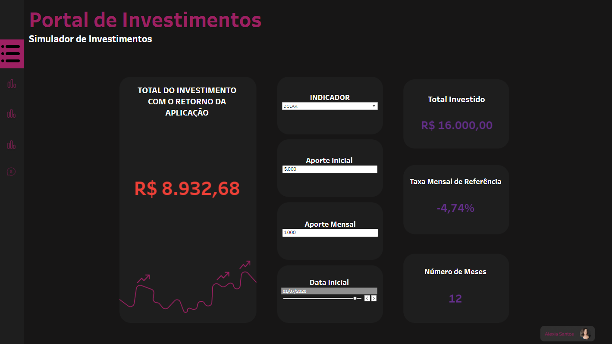

# Dashboard de Indicadores Econômicos
Como parte de um desafio técnico, desenvolvi um dashboard no Tableau com o objetivo de estabelecer um portal de investimentos. O escopo era apresentar um histórico detalhado dos indicadores no contexto brasileiro, com o crescimento em percentual em relação ao ano anterior *(PY)* capacitando os consultores a tomar decisões com base nos dados de rentabilidade. Ele fornece a evolução mensal e anual da rentabilidade, incluindo o acumulado até 2021, e um simulador de investimentos para todos os indicadores. 

### Ferramentas Utilizadas
- [Alteryx:](https://github.com/milexias/portal-investimentos/tree/main/Alteryx)
 Utilizado para processos ETL e modelagem de dados.
- [Tableau:](https://public.tableau.com/app/profile/alexia.santos/viz/PortaldeInvestimentos_16941998867240/Menu) Realização de cálculos, parâmetros e consolidação do dashboard.
- [Figma:](https://github.com/milexias/portal-investimentos/tree/main/Imagens) Ferramenta de design para a estrutura visual do dashboard.

### Os indicadores são divididos em:
- `Macroeconômicos`: Selic, IPCA, DI
- `Variáveis`: Bova11, Smal11
- `Câmbio`: Dólar, Bitcoin, Ethereum

<html lang="pt-br"><head>
<meta charset="utf-8"></head><body><h4> Conforme prévia do indicador abaixo: </h4></body></html>

### Simulador de Investimentos
Desenvolvi um protótipo de Simulador de Investimentos no Tableau, encontrei alguns desafios para a implentação das lógicas que gostaria de ter utilizado. Atualmente funciona como uma calculadora de juros compostos, com base na taxa mais recente de cada indicador. Ainda assim, esse recurso permite que consultores avaliem cenários hipotéticos, conforme o indicador desejado.

<html lang="pt-br"><head>
<meta charset="utf-8"></head><body><h4> Conforme prévia do indicador abaixo: </h4></body></html>

### Estrutura
Como premissa do desafio, o menu de hamburguer *(Collapsing Menu)* foi incorporado para facilitar o acesso à estrutura de cinco páginas do dashboard, com a primeira sendo dedicada à apresentação do mesmo.
## Considerações
O cenário econômico é dinâmico e sujeito a mudanças imprevistas que podem afetar significativamente os indicadores econômicos. Condições econômicas, políticas e sociais imprevisíveis podem impactar os mercados financeiros, e o desempenho passado dos indicadores pode não refletir as condições atuais.

Este projeto representa não apenas uma resposta ao desafio técnico e suas premissas, mas também uma solução interessante para a análise e visualização de dados financeiros. 

**Todo o desenvolvimento do projeto pode ser observado no repositório acima, bem como o resultado final no [Tableau Public:](https://public.tableau.com/app/profile/alexia.santos/viz/PortaldeInvestimentos_16941998867240/Menu).**

*Esta apresentação técnica destaca os principais aspectos do projeto, fornecendo uma visão abrangente das tecnologias utilizadas, da estrutura do dashboard, dos objetivos atingidos e das considerações pessoais importantes para a interpretação dos dados apresentados.*
